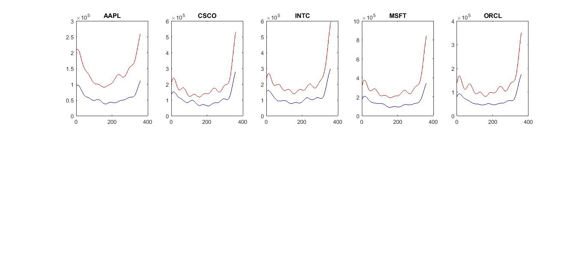

[](http://quantlet.de/)

## [](http://quantlet.de/) **M_MEM_DAT_Seasonal_Factors** [](http://quantlet.de/)

```yaml

Name of Quantlet: M_MEM_DAT_Seasonal_Factors

Published in: Local Adaptive Multiplicative Error Models for High-Frequency Forecasts

Description: 'Estimates intra-day periodicity components for cumulative one minute trading volumes (in units of
100,000 and plotted against the time of the day) of selected companies at NASDAQ on 2 September (lower, lowest
30-day trading volume) and 30 October 2008 (upper, highest 30-day volume)'

Keywords: local, adaptive, error, estimation, forecast, frequency, plot

See also: M_MEM_LMEM_Parameter_Dynamics_Figure, M_MEM_LMEM_Parameter_Dynamics_Results

Author: Wolfgang Karl Härdle, Nikolaus Hautsch, Andrija Mihoci

Submitted:  Thu, January 12 2017 by Andrija Mihoci

Datafile: ALL5_2008_Volume1, ALL5_2008_Days1

Example: M_MEM_DAT_Seasonal_Factors_Plot
```



### MATLAB Code
```matlab

% M_MEM_DAT_Seasonal_Factors
% Andrija Mihoci

clear all; clc;

%% Data: Load
ALL5_2008_Days1 = load('ALL5_2008_Days1');
ALL5_2008_Volume1 = load('ALL5_2008_Volume1');
DE = 30;
M = 6;
NE = 360;

%% Estimation: Run
for i = 1 : 1 : size(ALL5_2008_Volume1, 2)
  ALL5_2008_Volume1_NE_DE{i} = reshape(ALL5_2008_Volume1(:, i), 360, size(ALL5_2008_Days1, 1));
  ALL5_2008_Volume1_NE_DE{i} = ALL5_2008_Volume1_NE_DE{i}(1 : NE, :);
  [sf{i}, sa{i}, sB{i}] = M_MEM_Seasonality_Volume(ALL5_2008_Days1, ALL5_2008_Volume1_NE_DE{i}, NE, DE, M);
  ALL5sf1{i} = reshape(sf{i}.m1, NE * (size(ALL5_2008_Days1, 1) - DE), 1);
  ALL5sf2{i} = reshape(sf{i}.m2, NE * (size(ALL5_2008_Days1, 1) - DE), 1);
  ALL5sf3{i} = reshape(sf{i}.m3, NE * (size(ALL5_2008_Days1, 1) - DE), 1);
  ALL5sf4{i} = reshape(sf{i}.m4, NE * (size(ALL5_2008_Days1, 1) - DE), 1);
  ALL5sf5{i} = reshape(sf{i}.m5, NE * (size(ALL5_2008_Days1, 1) - DE), 1);
  ALL5sf6{i} = reshape(sf{i}.m6, NE * (size(ALL5_2008_Days1, 1) - DE), 1);
  
  ALL5sa1{i} = reshape(sa{i}.m1, NE * (size(ALL5_2008_Days1, 1) - DE), 1);
  ALL5sa2{i} = reshape(sa{i}.m2, NE * (size(ALL5_2008_Days1, 1) - DE), 1);
  ALL5sa3{i} = reshape(sa{i}.m3, NE * (size(ALL5_2008_Days1, 1) - DE), 1);
  ALL5sa4{i} = reshape(sa{i}.m4, NE * (size(ALL5_2008_Days1, 1) - DE), 1);
  ALL5sa5{i} = reshape(sa{i}.m5, NE * (size(ALL5_2008_Days1, 1) - DE), 1);
  ALL5sa6{i} = reshape(sa{i}.m6, NE * (size(ALL5_2008_Days1, 1) - DE), 1);
  
  ALL5sB1{i} = reshape(sB{i}.m1, (size(ALL5_2008_Days1, 1) - DE), 1);
  ALL5sB2{i} = reshape(sB{i}.m2, (size(ALL5_2008_Days1, 1) - DE), 1);
  ALL5sB3{i} = reshape(sB{i}.m3, (size(ALL5_2008_Days1, 1) - DE), 1);
  ALL5sB4{i} = reshape(sB{i}.m4, (size(ALL5_2008_Days1, 1) - DE), 1);
  ALL5sB5{i} = reshape(sB{i}.m5, (size(ALL5_2008_Days1, 1) - DE), 1);
  ALL5sB6{i} = reshape(sB{i}.m6, (size(ALL5_2008_Days1, 1) - DE), 1);
end

ALL5_2008_Volume1_Factor360_M1 = cell2mat(ALL5sf1);
ALL5_2008_Volume1_Factor360_M2 = cell2mat(ALL5sf2);
ALL5_2008_Volume1_Factor360_M3 = cell2mat(ALL5sf3);
ALL5_2008_Volume1_Factor360_M4 = cell2mat(ALL5sf4);
ALL5_2008_Volume1_Factor360_M5 = cell2mat(ALL5sf5);
ALL5_2008_Volume1_Factor360_M6 = cell2mat(ALL5sf6);

ALL5_2008_Volume1_Adjusted360_M1 = cell2mat(ALL5sa1);
ALL5_2008_Volume1_Adjusted360_M2 = cell2mat(ALL5sa2);
ALL5_2008_Volume1_Adjusted360_M3 = cell2mat(ALL5sa3);
ALL5_2008_Volume1_Adjusted360_M4 = cell2mat(ALL5sa4);
ALL5_2008_Volume1_Adjusted360_M5 = cell2mat(ALL5sa5);
ALL5_2008_Volume1_Adjusted360_M6 = cell2mat(ALL5sa6);

ALL5_2008_Volume1_BIC360_M1 = cell2mat(ALL5sB1);
ALL5_2008_Volume1_BIC360_M2 = cell2mat(ALL5sB2);
ALL5_2008_Volume1_BIC360_M3 = cell2mat(ALL5sB3);
ALL5_2008_Volume1_BIC360_M4 = cell2mat(ALL5sB4);
ALL5_2008_Volume1_BIC360_M5 = cell2mat(ALL5sB5);
ALL5_2008_Volume1_BIC360_M6 = cell2mat(ALL5sB6);

%% Output: Save

save('ALL5_2008_Volume1_Factor360_M1', 'ALL5_2008_Volume1_Factor360_M1', '-ascii');
save('ALL5_2008_Volume1_Factor360_M2', 'ALL5_2008_Volume1_Factor360_M2', '-ascii');
save('ALL5_2008_Volume1_Factor360_M3', 'ALL5_2008_Volume1_Factor360_M3', '-ascii');
save('ALL5_2008_Volume1_Factor360_M4', 'ALL5_2008_Volume1_Factor360_M4', '-ascii');
save('ALL5_2008_Volume1_Factor360_M5', 'ALL5_2008_Volume1_Factor360_M5', '-ascii');
save('ALL5_2008_Volume1_Factor360_M6', 'ALL5_2008_Volume1_Factor360_M6', '-ascii');

save('ALL5_2008_Volume1_Adjusted360_M1', 'ALL5_2008_Volume1_Adjusted360_M1', '-ascii');
save('ALL5_2008_Volume1_Adjusted360_M2', 'ALL5_2008_Volume1_Adjusted360_M2', '-ascii');
save('ALL5_2008_Volume1_Adjusted360_M3', 'ALL5_2008_Volume1_Adjusted360_M3', '-ascii');
save('ALL5_2008_Volume1_Adjusted360_M4', 'ALL5_2008_Volume1_Adjusted360_M4', '-ascii');
save('ALL5_2008_Volume1_Adjusted360_M5', 'ALL5_2008_Volume1_Adjusted360_M5', '-ascii');
save('ALL5_2008_Volume1_Adjusted360_M6', 'ALL5_2008_Volume1_Adjusted360_M6', '-ascii');

save('ALL5_2008_Volume1_BIC360_M1', 'ALL5_2008_Volume1_BIC360_M1', '-ascii');
save('ALL5_2008_Volume1_BIC360_M2', 'ALL5_2008_Volume1_BIC360_M2', '-ascii');
save('ALL5_2008_Volume1_BIC360_M3', 'ALL5_2008_Volume1_BIC360_M3', '-ascii');
save('ALL5_2008_Volume1_BIC360_M4', 'ALL5_2008_Volume1_BIC360_M4', '-ascii');
save('ALL5_2008_Volume1_BIC360_M5', 'ALL5_2008_Volume1_BIC360_M5', '-ascii');
save('ALL5_2008_Volume1_BIC360_M6', 'ALL5_2008_Volume1_BIC360_M6', '-ascii');

%% Graphical Illustration

d = [138, 180];
subplot(2, 5, 1), plot(ALL5_2008_Volume1_Factor360_M6(360 * (d(1) - 1) + 1 : 360 * d(1), 1), 'b'); title('AAPL'); hold on;
subplot(2, 5, 1), plot(ALL5_2008_Volume1_Factor360_M6(360 * (d(2) - 1) + 1 : 360 * d(2), 1), 'r'); title('AAPL'); hold on;
subplot(2, 5, 2), plot(ALL5_2008_Volume1_Factor360_M6(360 * (d(1) - 1) + 1 : 360 * d(1), 2), 'b'); title('CSCO'); hold on;
subplot(2, 5, 2), plot(ALL5_2008_Volume1_Factor360_M6(360 * (d(2) - 1) + 1 : 360 * d(2), 2), 'r'); title('CSCO'); hold on;
subplot(2, 5, 3), plot(ALL5_2008_Volume1_Factor360_M6(360 * (d(1) - 1) + 1 : 360 * d(1), 3), 'b'); title('INTC'); hold on;
subplot(2, 5, 3), plot(ALL5_2008_Volume1_Factor360_M6(360 * (d(2) - 1) + 1 : 360 * d(2), 3), 'r'); title('INTC'); hold on;
subplot(2, 5, 4), plot(ALL5_2008_Volume1_Factor360_M6(360 * (d(1) - 1) + 1 : 360 * d(1), 4), 'b'); title('MSFT'); hold on;
subplot(2, 5, 4), plot(ALL5_2008_Volume1_Factor360_M6(360 * (d(2) - 1) + 1 : 360 * d(2), 4), 'r'); title('MSFT'); hold on;
subplot(2, 5, 5), plot(ALL5_2008_Volume1_Factor360_M6(360 * (d(1) - 1) + 1 : 360 * d(1), 5), 'b'); title('ORCL'); hold on;
subplot(2, 5, 5), plot(ALL5_2008_Volume1_Factor360_M6(360 * (d(2) - 1) + 1 : 360 * d(2), 5), 'r'); title('ORCL'); hold on;


```

automatically created on 2018-05-28