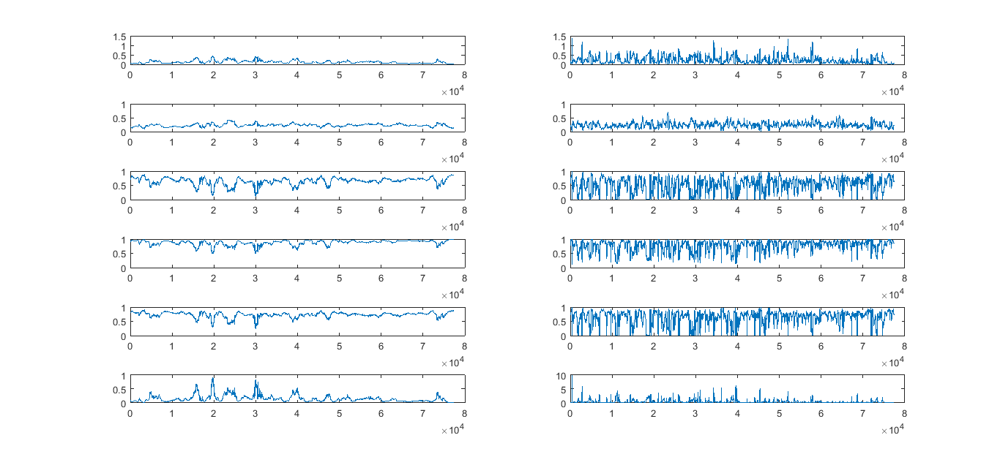

[](http://quantlet.de/)

## [](http://quantlet.de/) **M_MEM_LMEM_Parameter_Dynamics_Figure** [](http://quantlet.de/)

```yaml

Name of Quantlet: M_MEM_LMEM_Parameter_Dynamics_Figure

Published in: Local Adaptive Multiplicative Error Models for High-Frequency Forecasts

Description: 'Time series of estimated weekly (left panel, rolling windows covering 1800 observations) and daily
(right panel, rolling windows covering 360 observations) EACD(1, 1) parameters and functions thereof based on
seasonally adjusted 1-minute trading volumes for Intel Corporation (INTC) at each minute from 22 February to
31 December 2008'

Keywords: local, adaptive, error, estimation, forecast, frequency, parameter

See also: M_MEM_DAT_Seasonal_Factors,  M_MEM_LMEM_Parameter_Dynamics_Results

Author: Wolfgang Karl Härdle, Nikolaus Hautsch, Andrija Mihoci

Submitted: Thu, January 12 2017 by Andrija Mihoci

Datafile: INTC_EACD_Theta

Example: M_MEM_LMEM_Parameter_Dynamics_Plot
```



### MATLAB Code
```matlab

% M_MEM_LMEM_Parameter_Dynamics_Figure
% Andrija Mihoci

clear all; clc;

INTC_EACD_Theta = load('INTC_EACD_Theta');
INTC_EACD_Th = reshape(INTC_EACD_Theta, 30, 77400);

% Weekly
subplot(6, 2, 1), plot(INTC_EACD_Th(1, :)); ylim([0, 1.5]);
subplot(6, 2, 3), plot(INTC_EACD_Th(2, :)); ylim([0, 1]);
subplot(6, 2, 5), plot(INTC_EACD_Th(3, :)); ylim([0, 1]);
subplot(6, 2, 7), plot(INTC_EACD_Th(5, :)); ylim([0, 1]);
subplot(6, 2, 9), plot(INTC_EACD_Th(3, :) ./ INTC_EACD_Th(5, :)); ylim([0, 1]);
subplot(6, 2, 11), plot(INTC_EACD_Th(1, :) ./ INTC_EACD_Th(5, :)); ylim([0, 1]);

% Daily
subplot(6, 2, 2), plot(INTC_EACD_Th(11, :)); ylim([0, 1.5]);
subplot(6, 2, 4), plot(INTC_EACD_Th(12, :)); ylim([0, 1]);
subplot(6, 2, 6), plot(INTC_EACD_Th(13, :)); ylim([0, 1]);
subplot(6, 2, 8), plot(INTC_EACD_Th(15, :)); ylim([0, 1]);
subplot(6, 2, 10), plot(INTC_EACD_Th(13, :) ./ INTC_EACD_Th(15, :)); ylim([0, 1]);
subplot(6, 2, 12), plot(INTC_EACD_Th(11, :) ./ INTC_EACD_Th(15, :)); ylim([0, 10]);


```

automatically created on 2018-05-28